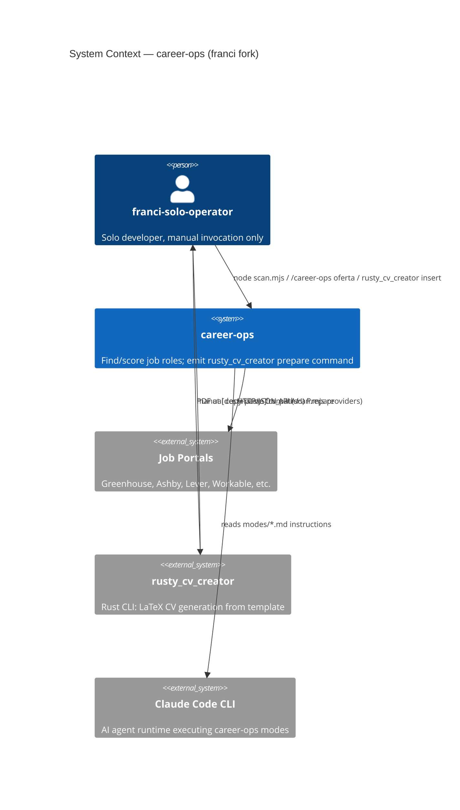

# Architecture Brief — career-ops (franci fork)

**Scope**: personal fork of career-ops v1.8.x; find/score/prepare-only operator
**Maintainer**: franci-solo-operator
**Last updated**: 2026-06-09 (mvp-adoption DESIGN wave)

---

## Application Architecture

*Section owner: nw-solution-architect (mvp-adoption wave)*

### System purpose

A CLI-driven job search operator that finds roles, scores them against a profile,
and emits a ready-to-run `rusty_cv_creator` command for CV generation. No outbound
actions (no form submission, no LinkedIn contact) — ever.

### Quality attribute priorities

1. **Safety** — no accidental outbound action (hard-delete apply/contacto; keystone test gate)
2. **Auditability** — mechanical proof via test suite; re-introduction vector patched
3. **Simplicity** — brownfield surgical edits; no new abstractions
4. **Maintainability** — SYSTEM_PATHS patched so upstream updates don't re-introduce deleted modes

### Architecture pattern

Modular markdown-instruction + Node.js-script flat structure.
No layered architecture, no hexagonal ports in the Node.js code sense.
The "ports" are the CLI surfaces and the file conventions (reports/, data/, modes/).



```mermaid
C4Container
  title Container Diagram — career-ops (franci fork)

  Person(user, "franci-solo-operator")

  Container(scanner, "Scanner", "Node.js / scan.mjs", "Hits portal APIs; writes new URLs to data/pipeline.md")
  Container(evaluator, "Evaluator", "Claude Code + modes/oferta.md + modes/_shared.md", "A-G scoring + H) Prepare block")
  Container(testgate, "Keystone Gate", "Node.js / test-all.mjs", "Asserts apply/contacto absent; asserts SYSTEM_PATHS clean")
  Container_Ext(rustycv, "rusty_cv_creator", "Rust binary", "Template copy + xelatex compile → PDF")

  Rel(user, scanner, "node scan.mjs")
  Rel(scanner, "data/pipeline.md", "writes URLs")
  Rel(user, evaluator, "/career-ops oferta {url}")
  Rel(evaluator, "reports/", "writes evaluation report with H) Prepare block")
  Rel(user, rustycv, "manual: rusty_cv_creator insert ... (copied from H block)")
  Rel(user, testgate, "node test-all.mjs")
  Rel(testgate, "modes/", "fs.existsSync() absence checks")
  Rel(testgate, "update-system.mjs", "SYSTEM_PATHS string search (re-introduction vector)")
```

### Component boundaries (mvp-adoption changes only)

See `docs/feature/mvp-adoption/feature-delta.md` — Wave: DESIGN / [REF] Component Decomposition.

### Integration contract: career-ops → rusty_cv_creator

Input (emitted by H) Prepare block):
- `--job-title`: exact title from JD
- `--company-name`: short company name
- `--quote`: ≤120 char sentence (CLI accepts; injection currently inactive — B-CV-01)

Runtime constraint:
- `engine=sqlite` in `~/.config/rusty-cv-creator/rusty-cv-config.ini` for PG-less MVP
- `--save-to-database` omitted (defaults to `false`)
- No Tailscale, no fleet Postgres required

### ADRs

- `adr-D22-manual-handoff.md` — Manual rusty_cv_creator invocation
- `adr-D25-keystone-system-paths.md` — Keystone gate includes SYSTEM_PATHS check
- `adr-D9-no-new-abstractions.md` — Brownfield surgical edit; no new pattern
